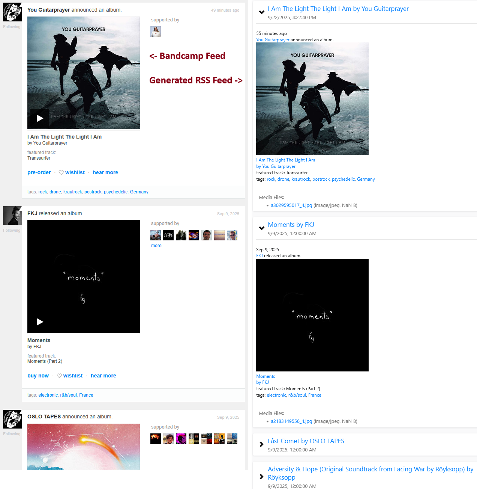

[](https://stand-with-ukraine.pp.ua)
[](https://stand-with-ukraine.pp.ua)
[](https://stand-with-ukraine.pp.ua)
[](https://stand-with-ukraine.pp.ua)

Bandcamp Newsfeed RSS Feed Generator
---------------------------

FastAPI RSS Feed Generator for your Bandcamp newsfeed

Makes RSS feed out of your https://bandcamp.com/{BANDCAMP_USERNAME}/feed,
so you can follow the new releases using your favorite RSS reader




## Features

- Converts Bandcamp newsfeed to RSS/Atom feeds
- Embeds the entry HTML into the RSS entry
- Configurable caching
- Health check endpoint for monitoring


## Usage

1. Get your Bandcamp identity cookie (described below)
2. Create `.env` file with required variables (described below)
3. Run locally or deploy using one of the methods described below


## Configuration

* Create `.env` file using [.env.example](.env.example)
```
BANDCAMP_USERNAME=my_bandcamp_username
# "identity" cookie from Bandcamp (required for private feeds)
IDENTITY=7%09ABCV1A%2B12D12D12ABCDEJbOCvA8Mfi90betEmFcYfhs%3D%09%7B%22id%22%3A135750916%2C%22ex%22%3A0%7D
PORT=8000
CACHE_DURATION_SECONDS=3600
TZ=Europe/Kiev
VERBOSE=0
```

## Getting Your Bandcamp Identity Cookie

1. Log into Bandcamp in your browser
2. Open Developer Tools (F12)
3. Go to Network tab
4. Visit your feed page: `https://bandcamp.com/YOUR_USERNAME/feed`
5. Look for the request to this URL
6. In the request headers, find the `Cookie` header
7. Copy the `identity=...` value


## Endpoints

- `/rss` - RSS 2.0 feed
- `/atom` - Atom feed
- `/health` - Health check


## Running locally

* Install [uv](https://docs.astral.sh/uv/getting-started/installation/)
* Pre-create `.env` using [.env.example](.env.example)
* Run the project
```bash
uv run bandcamp_newsfeed_rss
```
* Open http://127.0.0.1:8000/rss in the browser.
Other endpoints are described below

## Docker Deployment

### Building the image and running the container
```bash
# Build the image
docker build -t bandcamp_newsfeed_rss .

# Run the container using .env file
docker run -p 8000:8000 --env-file .env bandcamp_newsfeed_rss

# Or run the container using the environment variable arguments
docker run -p 8000:8000 \
  -e BANDCAMP_USERNAME=your_username \
  -e IDENTITY=your_identity_cookie \
  -e TZ=Europe/Kiev \
  bandcamp_newsfeed_rss
```

### Using the pre-built image
```bash
# Run the container using .env file
docker run -p 8000:8000 --env-file .env ghcr.io/alertua/bandcamp_newsfeed_rss

# Or run the container using the environment variable arguments
docker run -p 8000:8000 \
  -e BANDCAMP_USERNAME=your_username \
  -e IDENTITY=your_identity_cookie \
  -e TZ=Europe/Kiev \
  ghcr.io/alertua/bandcamp_newsfeed_rss
```

## Troubleshooting

**Feed not loading?**
- Verify your `BANDCAMP_USERNAME` is correct
- Check that your identity cookie is valid (not expired)
- Ensure you have access to the Bandcamp feed

**Empty feed?**
- Check if your Bandcamp feed has any items
- Verify cookie permissions for private content

**Docker issues?**
- Ensure `.env` file exists in the current directory
- Check port 8000 is not already in use


## Contributing

Contributions are welcome! Please feel free to submit a Pull Request.

1. Fork the repository
2. Create your feature branch (`git checkout -b feature/AmazingFeature`)
3. Commit your changes (`git commit -m 'Add some AmazingFeature'`)
4. Push to the branch (`git push origin feature/AmazingFeature`)
5. Open a Pull Request
